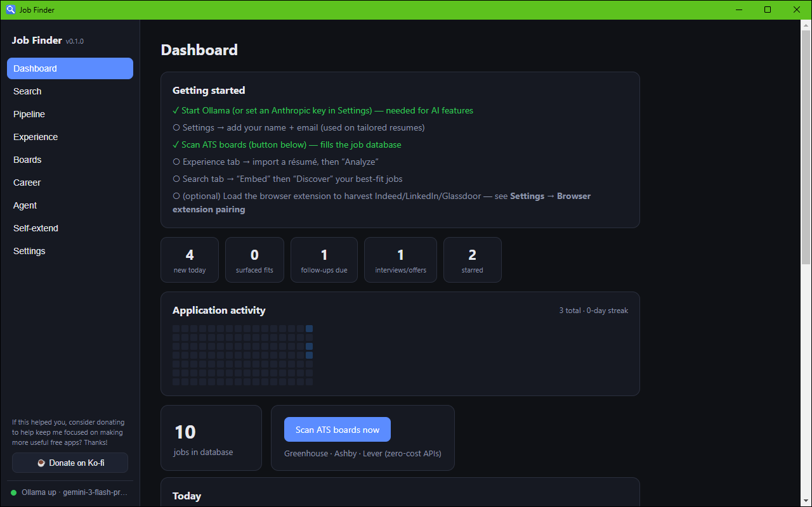
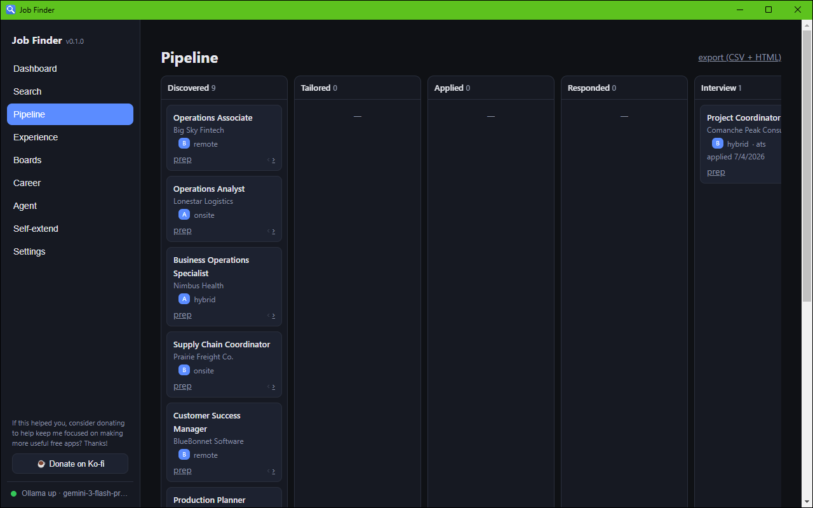

# Job Finder

A free, local job search app. Scan job boards, find roles that actually fit your experience, tailor applications, and track everything in a kanban pipeline. It all runs in a desktop app and your data never leaves your machine.

[](https://github.com/Slagathore/job-finder-v2/releases/latest)


[Download the latest release](https://github.com/Slagathore/job-finder-v2/releases/latest) for Windows (signed), macOS, or Linux.



## Why this exists

Job hunting is a second job with worse tooling. Boards bury good listings, aggregators re-post ghosts, and "easy apply" pipelines are built for employers, not you. Job Finder flips that. It is built entirely for the applicant, runs entirely on your computer, and uses AI only where it actually helps, which is matching your real experience to real openings.

No account. No cloud. No telemetry. Your resume, applications, and search history live in a local SQLite file you can open, back up, or delete.

## What it does

- Scans ATS boards directly. Greenhouse, Ashby, and Lever public APIs, no scraping, no cost.
- Harvests hostile boards through a companion browser extension: Indeed, LinkedIn, CareerBuilder, Glassdoor, ZipRecruiter. One click sends the visible listings to your local app, and only there, since the extension talks exclusively to `127.0.0.1`.
- Digests your resumes into an experience engine: reusable accomplishment line items, inferred role fits, and matches across industries you would not have thought to search for.
- Semantic discovery. Embeddings-based matching weighted by pay and remote or hybrid preference, with A to F fit grades and a rationale.
- Grounded salary data from BLS OEWS medians when a listing won't say.
- Tailors documents. CV and cover letter drafts tuned to each listing, built from your own line items, with no invented experience.
- Kanban pipeline: discovered, tailored, applied, responded, interview, offer, with follow-up nudges.
- Optional Gmail ingest. Replies advance your pipeline automatically, and interview or offer emails get confetti.
- A conversational agent that drives the app ("find me remote analyst roles over $70k"), with a permission gate on every capability and an audit log. Applying is always off by default.
- Application insights. Response-rate patterns by fit grade, work mode, and source, so you learn where your applications actually land.
- Contacts and outreach. Track recruiters and hiring managers, or auto-discover them, then draft a 300-character LinkedIn message that doesn't sound like everyone else's.
- Interview toolkit. A persistent STAR story bank that grows with every prep, a portfolio-project evaluator, a course and cert worth-it evaluator, and a deep-research prompt generator.



## Install

Grab a build from the [latest release](https://github.com/Slagathore/job-finder-v2/releases/latest):

| Platform | File | Notes |
|---|---|---|
| Windows | `JobFinder-*-Setup.exe` (installer) or `-portable.exe` | Signed. This is the platform it was built and tested on. |
| macOS | `.dmg` or `.zip` (Intel + Apple Silicon) | Unsigned. First launch needs right-click then Open (see below). |
| Linux | `.AppImage` or `.deb` | Install a keyring (`gnome-keyring`/`libsecret`) if you will use Gmail or an API key. |

A first-run wizard asks for your name and email, your AI backend, and whether to keep the bundled starter boards. Then hit Scan ATS boards now and real jobs land in the database, no AI or account required.

<details>
<summary><b>macOS: "Job Finder is damaged and can't be opened"</b></summary>

The Mac build isn't notarized (Apple charges $99/yr for that), so Gatekeeper blocks it. It isn't damaged. Either:
- Right-click the app, then Open, then Open, or
- `xattr -dr com.apple.quarantine "/Applications/Job Finder.app"`
</details>

AI backend (optional, pick one):
- [Ollama](https://ollama.com) running locally, plus `ollama pull nomic-embed-text` for semantic search. Free and fully local.
- Or an Anthropic API key in Settings.

The app works without either. Scanning, harvesting, and the pipeline are plain code. AI powers matching, digesting, and tailoring.

## Build from source

```bash
git clone https://github.com/Slagathore/job-finder-v2.git
cd job-finder-v2
npm install
npm run dev      # development (Vite on 5177 + Electron)
npm test         # 148 tests
npm run dist     # package for your platform, output in dist-installer/
```

Windows release builds are signed through Azure Artifact Signing, see [SIGNING.md](SIGNING.md). `npm run dist` produces an unsigned build and needs no credentials.

## The browser extension

Some boards can't be scanned politely from outside the browser. The extension harvests what you're already looking at:

1. Load it: `chrome://extensions`, turn on Developer mode, Load unpacked, select the `extension/` folder. (A Chrome Web Store listing is in review, which will make this step easier.)
2. In the app: Settings, then Browser extension pairing. Copy the hub token.
3. Click the extension icon, paste the token, hit Test.
4. Browse Indeed, LinkedIn, and the rest, then click Harvest (or turn on auto-harvest).

Everything it collects goes to your local app over `127.0.0.1`, see [its privacy policy](extension/PRIVACY.md). It requests a single Chrome permission (`storage`).

## Privacy, in one paragraph

There is no server. The app's own docs, database, backups, and exports all live in your user data folder. The extension ships listings to localhost. Gmail access, if you opt in, uses your own OAuth credentials and only labels and reads application-related threads. API keys and OAuth tokens are encrypted at rest with your OS keychain. If no keychain is available, the app refuses to store them rather than writing them to disk in cleartext. The agent's riskier capabilities, sending email and applying, are permission-gated per capability, individually, in Settings, and bulk apply is additionally gated by a blocklist and listing-liveness checks.

## Architecture

Electron, React, TypeScript, and Vite, with `better-sqlite3` for storage, a provider-agnostic LLM layer (`electron/llm/provider.ts`), and Vitest (148 tests). The full design doc, including the self-extension sandbox, permission matrix, and per-phase build history, is in [PLAN.md](PLAN.md).

## Platform status

Windows is the platform this was built and daily-driven on. The macOS and Linux builds compile, package, and pass the full test suite on their native CI runners, but they haven't had real-world mileage yet. If you hit something on either, [open an issue](https://github.com/Slagathore/job-finder-v2/issues). That feedback is the fastest way to get them solid.

## Contributing

Issues and PRs welcome. Good first contributions: new board scrapers (`extension/content/`), new ATS integrations (`electron/scan/`), and macOS or Linux bug reports. Known gaps and planned work live in [TODO.md](TODO.md).

## Support

This is free and always will be. If it helped you land something, or just saved you an evening of copy-pasting, consider [buying me a coffee on Ko-fi](https://ko-fi.com/sparklemuffin) so I can keep making useful free apps. Thanks.

## License

[MIT](LICENSE)
